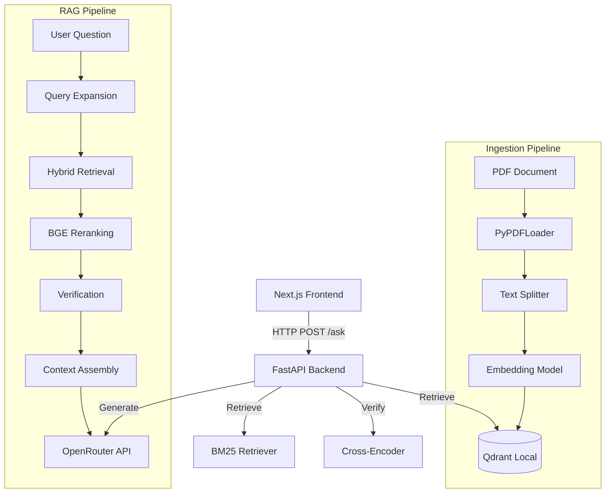

# RAG Q&A Chatbot

This project is a Retrieval-Augmented Generation (RAG) application designed to answer questions based on the document `Schatzinsel_E.pdf`. It includes a backend API (FastAPI) and a frontend chat interface (Next.js).

## 📋 Table of Contents

- [Project Overview](#project-overview)
- [Architecture](#architecture)
- [Project Structure](#project-structure)
- [Prerequisites](#prerequisites)
- [Quick Start](#quick-start)
- [Usage](#usage)
- [API Documentation](#api-documentation)

## 🔭 Project Overview

The objective of this project is to provide an intelligent Q&A system that:
1.  **Ingests** a PDF document, splits it into chunks, and stores embeddings in a **Qdrant** vector database.
2.  **Retrieves** relevant context using a hybrid search approach (Dense Retrieval with Qdrant + Sparse Retrieval with BM25).
3.  **Generates** answers using an LLM (via OpenRouter) based on the retrieved context.
4.  **Updates** the user via a modern chat interface.

## 🏗️ Architecture

The system follows a microservices architecture managed by Docker Compose.



## 📂 Project Structure

```
├── backend/                  # Python FastAPI Backend
│   ├── ingest.py             # Script for document ingestion
│   ├── main.py               # API Server Entrypoint
│   ├── rag_chatbot_qdrant.py # RAG logic and classes
│   ├── requirements.txt      # Python dependencies
│   ├── Dockerfile            # Backend Docker image
│   └── Schatzinsel_E.pdf     # Source Document
│
├── frontend/                 # Next.js Frontend
│   ├── app/                  # App Router pages and layout
│   └── Dockerfile            # Frontend Docker image
│
├── docker-compose.yml        # Service orchestration
├── docker.sh                 # Management script
├── .env                      # Environment variables
└── README.md                 # This documentation
```

## ⚙️ Prerequisites

- **Docker** and **Docker Compose** installed on your machine.
- An **OpenRouter API Key** configured in the `.env` file.

## 🚀 Quick Start

1.  **Clone the repository** (if you haven't already).
2.  **Configure Environment**:
    Ensure the `.env` file exists in the root directory and contains your `OPENROUTER_API_KEY`.
    
    ```env
    OPENROUTER_API_KEY=your_key_here
    ```

3.  **Build the Project**:
    ```bash
    ./docker.sh build
    ```

4.  **Ingest Data**:
    This step parses the PDF and populates the vector database.
    ```bash
    ./docker.sh ingest
    ```

5.  **Start Services**:
    ```bash
    ./docker.sh up
    ```

6.  **Access the Application**:
    - **Frontend**: [http://localhost:3000](http://localhost:3000)
    - **Backend API Docs**: [http://localhost:8001/docs](http://localhost:8001/docs)

## 🛠️ Usage

Use the `docker.sh` script to manage the application lifecycle.

| Command | Description |
| :--- | :--- |
| `./docker.sh build` | Builds the Docker images for backend and frontend. |
| `./docker.sh ingest` | Runs the ingestion script to process documents. |
| `./docker.sh up` | Starts the services in the background. |
| `./docker.sh down` | Stops and removes the containers. |
| `./docker.sh logs` | Displays the logs from running containers. |

## 📚 API Documentation

The backend provides a single endpoint for Q&A.

**Endpoint:** `POST /ask`

**Request:**
```json
{
  "question": "Who is the captain?"
}
```

**Response:**
```json
{
  "answer": "The captain is Smollett...",
  "sources": ["Schatzinsel_E.pdf"]
}
```
